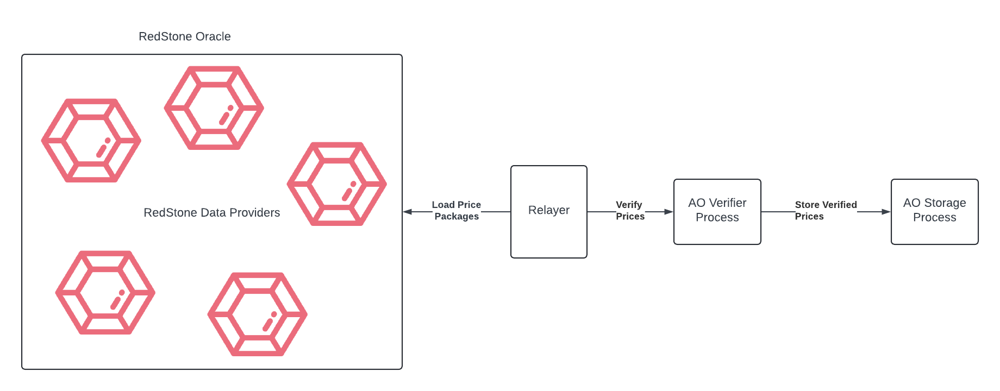

# AO RedStone Oracle

## High level overview



1. The AO Builders **Relayer** is loading a subset of prices offered
   by [RedStone Primary Data Service](https://app.redstone.finance/#/app/data-services/redstone-primary-prod).  
   Currently, offered prices (in relation to USD) are:  
   "BTC", "ETH", "USDC", "USDT", "SOL", "stETH", "AR"
2. The **Relayer** sends the RedStone data to the **[Verifier Process](https://www.ao.link/#/entity/ILnN6EL4zUE3nPovKBwvOl8GvC2RsvE8x_JYG8Fx6aY)** ([code](https://github.com/warp-contracts/ao-redstone-oracle/blob/main/redstone-oracle-process/warp/oracle.process.mjs)).
3. The **Oracle Verifier Process** [verifies](https://github.com/warp-contracts/ao-redstone-oracle/blob/main/redstone-oracle-process/warp/oracle.process.mjs#L76)
   the prices signatures and timestamps using the official RedStone
   protocol [package](https://github.com/redstone-finance/redstone-oracles-monorepo/tree/main/packages/protocol).
   This package is attached to the Process code via Warp
   QuickJs [plugin](https://github.com/warp-contracts/warp-contracts-plugins/blob/main/warp-contracts-plugin-quickjs/src/eval/QuickJsEvaluator.ts#L54).
4. If the prices are properly verified - i.e.
    - They are signed by a set of trusted RedStone nodes
    - Their timestamp is not too old in relation to the message timestamp

   they are sent to the **[Storage Process](https://www.ao.link/#/entity/KvQhYDJTQwpS3huPUJy5xybUDN3L8SE1mhLOBAt5l6Y)** ([code](https://github.com/warp-contracts/ao-redstone-oracle/blob/main/redstone-oracle-process/process.lua)).
5. The **Oracle Storage Process** can be used by other Processes in the AO Testnet to load prices.

## Ask for price from the **Oracle Storage Process**

If you want to ask for a price from your process - send a message to the **Oracle Storage Process** with
`Action = 'Request-Latest-Data'` and `Tickers = ['AR', 'ETH', ...]`

Example:

```lua
ao.send({
    Target = 'KvQhYDJTQwpS3huPUJy5xybUDN3L8SE1mhLOBAt5l6Y', -- the Oracle Storage Process id
    ReqId = msg.Id,
    Action = "Request-Latest-Data",
    Tickers = json.encode({ "AR" }) -- required prices
})
```

In response, the **Oracle Storage Process** [sends](https://github.com/warp-contracts/ao-redstone-oracle/blob/main/redstone-oracle-process/process.lua#L37) `Action = "Receive-RedStone-Prices"` with all the requested prices
in the `Data`. Example `Data` in the message:

```
"Data": {
   "AR": {
      "a": "0x51Ce04Be4b3E32572C4Ec9135221d0691Ba7d202", // the address of the RedStone node which provided the price
      "v": 27.346234546008, // the price value
      "t": 1719774710000 // the timestamp of the price
   }
}
```

Example asking contract is [here](https://github.com/warp-contracts/ao-redstone-oracle/blob/main/redstone-oracle-process/example-asking-process/process.lua).

### Process Ids

1. AO Testnet Oracle Storage Process - https://www.ao.link/#/entity/KvQhYDJTQwpS3huPUJy5xybUDN3L8SE1mhLOBAt5l6Y
    1. Process `fev8nSrdplynxom78XaQ65jSo7-88RxVVVPwHG8ffZk`
    2. Module `PuJq3dcddz-JZBaYAP3tpEdogFdiyh8HO5tUSGol2N0`
2. AO Warp Testnet Verifier Process - https://www.ao.link/#/entity/ILnN6EL4zUE3nPovKBwvOl8GvC2RsvE8x_JYG8Fx6aY
    1. Process `WrD1ew6AnpnGZwtJo1-LSxX7T79s42WkYOSaXk7Gvv4`
    2. Module `iSxR0exVxlpL26emdzNAa5YLvuL5aqDJX8tz5QiESS4`
3. AO Testnet Example asking process - https://www.ao.link/#/entity/MPFcKWy8GRVQhNVqGsmqV2AVLwmN5XewsWct_EBXEhs
    1. Process `mwhpR_CYe1JFTPYjOdbxKHphZUE0fMFenWY9Jo1kJKY`
    2. Module `pNwWAYW5cVPiOv1vJpxParYc0YxkuQRyV5w3oEQ6nnU`

